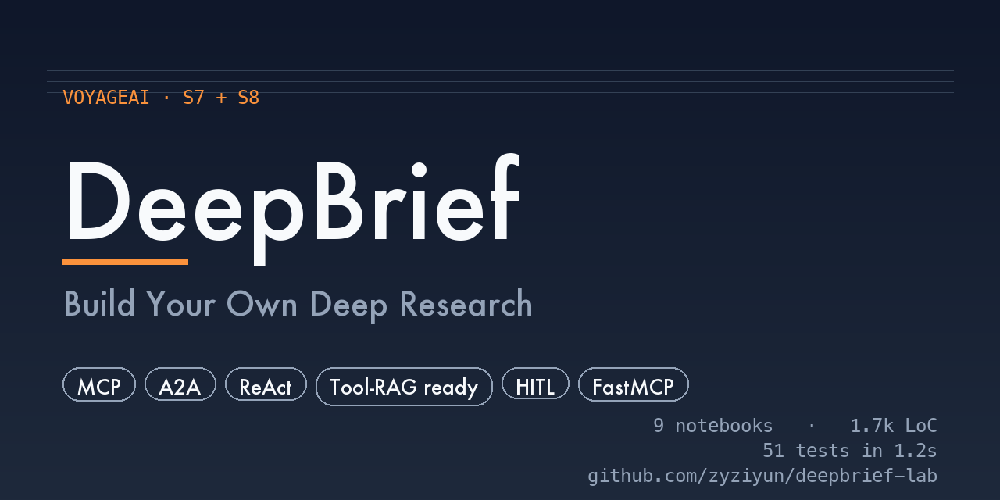

# DeepBrief — Build Your Own Deep Research



A hands-on lab for students learning to build production-grade LLM agents. You'll build a minimal **Deep Research clone** — a multi-agent system that takes a topic and produces a structured brief with citations — across 12 self-contained Jupyter notebooks.

You'll cover: the ReAct agent loop, tool design with strict mode, termination and cost caps, MCP servers and clients (stdio + Streamable HTTP), agent-to-agent communication (A2A), LangGraph orchestration, human-in-the-loop approval gates, and a production worker pipeline with Redis Streams and idempotency locks.

## What You'll Build

By the end, `python -m deepbrief.run` accepts a topic and produces a `brief.md`:

```
You: "State of WebGPU adoption in 2026"
        ↓
Coordinator agent     decomposes into 3-5 sub-questions
        ↓ (A2A)
Researcher agents     run in parallel; each calls web_search + fetch_url MCP tools
        ↓
Synthesizer agent     merges findings into a draft brief
        ↓
Editor (HITL gate)    you approve / reject / edit before it's saved
        ↓
brief.md              with [1][2] citations and a sources list
```

## Notebooks

| # | Notebook | What you build |
|---|---|---|
| 00 | Setup | Env smoke-test (`.env`, OpenAI key, optional Tavily key) |
| 01 | The Agent Loop | The 6-line ReAct loop, then production-hardened with parallel calls, error isolation, and graceful termination |
| 02 | Tools & Strict Mode | `BaseTool` ABC, `ToolRegistry`, OpenAI `strict: True`, tool description engineering |
| 03 | Termination & Cost | `CostMeter` budget cap, `LoopGuard` fingerprint detection, graceful termination on trip |
| 04 | FastMCP Server | Your first MCP server via `@mcp.tool()`, debugged with the MCP Inspector |
| 05 | MCP Transports | Same server over stdio AND Streamable HTTP, plus a second `cache_server` |
| 06 | MCP in the Agent | `MCPToolAdapter` — mixed local Python + remote MCP tools in one registry |
| 07 | Multi-Agent + A2A | Coordinator + two researcher agents, AgentCard discovery, `tasks/send` JSON-RPC |
| 07b | LangGraph Rewrite | Same multi-agent pipeline reimplemented on `StateGraph` with reducers and `Send` API |
| 08 | HITL Capstone | Tier-2 sync approval gate via `ApprovalStore` + `ipywidgets`, full end-to-end DeepBrief |
| 08b | LangGraph HITL | Same capstone with `AsyncSqliteSaver`, `interrupt()`, and time-travel debugging |
| 09 | Production Pipeline | FastAPI + Redis Streams + SETNX idempotency lock + SSE progress + SQLite store |

Each notebook is independent — you can jump in anywhere. The capstone (notebook 08, 08b, or 09) wires everything together.

## Prereqs

- Python 3.11+
- [`uv`](https://docs.astral.sh/uv/) (recommended) or pip
- An OpenAI API key (or any OpenAI-compatible endpoint)
- A free [Tavily API key](https://tavily.com) — 1000 searches/month free, needed from notebook 04 onward
- Node.js 18+ — only for the MCP Inspector in notebook 04

## Install

```bash
git clone <this-repo-url>
cd deepbrief-lab
uv sync
cp .env.example .env
# fill in OPENAI_API_KEY and TAVILY_API_KEY in .env
```

Run notebooks:

```bash
uv run jupyter lab notebooks/
```

## Tests

51 unit tests for the library code (`src/deepbrief/`). No API keys, no network — runs in ~1.5 seconds:

```bash
uv sync --extra dev      # one-time
uv run pytest            # run all tests
uv run pytest -v         # show each test name
uv run pytest -k editor  # filter by name
```

See [`tests/README.md`](tests/README.md) for the full guide (how to run a single test, coverage, async/ASGI patterns, etc.).

## Repo Layout

```
deepbrief-lab/
├── notebooks/                      # 9 self-contained Jupyter notebooks
├── src/deepbrief/                  # reusable package — used by capstone
│   ├── tools/                      # BaseTool, ToolRegistry, web_search, fetch_url
│   ├── agents/                     # ReActAgent, coordinator, researcher, editor
│   ├── mcp_servers/                # notes_server (stdio), cache_server (HTTP)
│   └── a2a/                        # AgentCard + JSON-RPC server
└── tests/
```

## Credits

Built as a teaching lab for the VoyageAI Full-Stack AI Engineering course.
Designed by Wendy Yu.

## License

MIT
